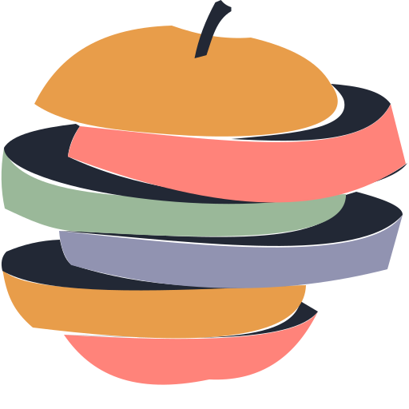
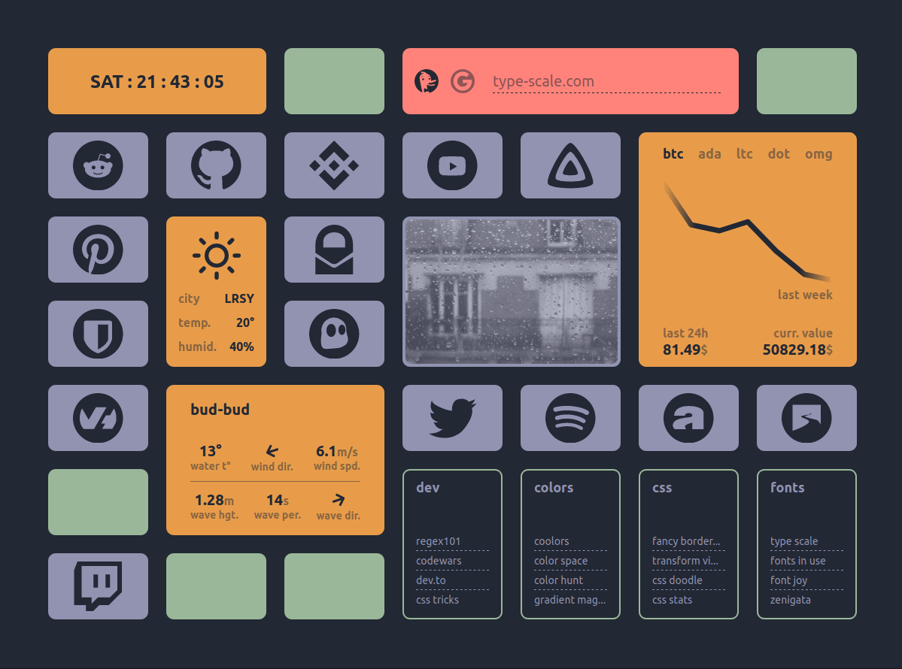
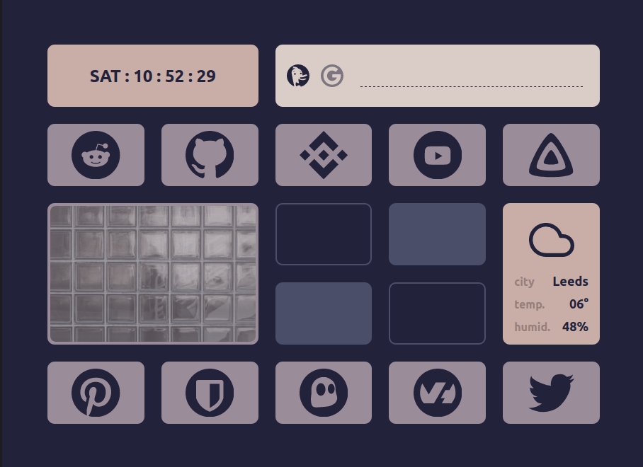
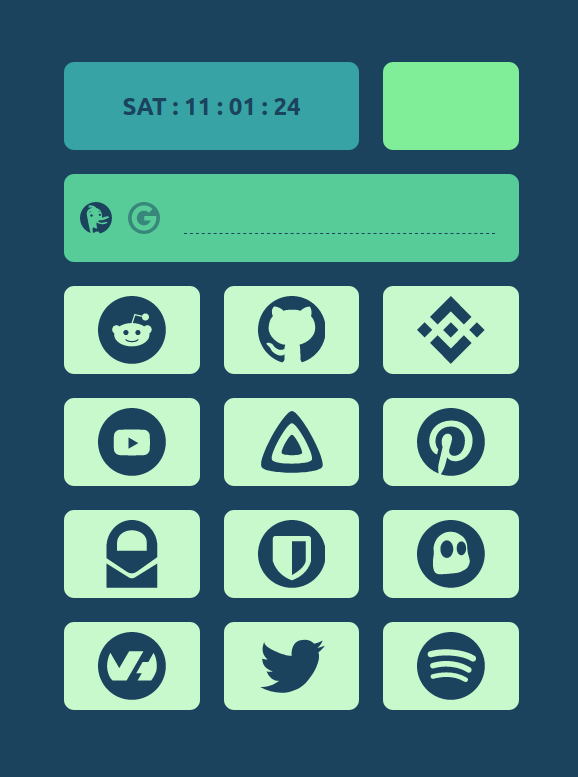

<p align="center">
  
</p>

<div align="center">
    <h1>Pomme Page</h1>
    <b>big buttons with easy click startpage for a browser</b>
</div>

<p align="center">
  
</p>

<p align="center">
  
  
</p>

## Index
- [Pomme Page](#)
  - [About](#about)
  - [Features](#features)
  - [Built With](#Built-with)
  - [Getting Started](#Getting-started)
  - [Installation](#Installation)
  - [Usage](#Usage)
  - [Modules](#Modules)
  - [Customization](#Customization)
    - [Layout](#Layout)
    - [Links](#links)
    - [Modules](#Modules)
    - [Colors](#Colors)
  - [Deploying](#Deploying)
  - [Contribution](#Contribution)
  - [More Start Pages](#More-start-pages)
  - [Licence](#Licence)

## About
I made this project to test stuffs like parcelJs, pug and other cool things in my free time. You can check a demo [here](https://kikiklang.github.io/pomme-page/) to see how this page behaves and how it could look like in your browser with your screen resolution. The default configuration is probably not great for your needs, but however, with a little time, you can achieve a nice result.

## Features
- **Theming** Custom colors with css variables.
- **Responsive** Unpredictive layout thanks to CSS grid :)
- **Modular** each square is a module that you can move / remove / duplicate / customize
- **Fast loading** no dependencies, no framework, no super heavy advanced features, it's light.

## Built with
- [Parcel](https://parceljs.org/) Blazing fast, zero configuration web application bundler
- [Pug](https://pugjs.org/api/getting-started.html) Pug is a template engine for Node and for the browser. It compiles to HTML and has a simplified syntax.

## Getting Started
To get a local copy up and running, you will need:

- [git](https://git-scm.com/downloads)
- [nodejs](https://nodejs.org/en/)- Node.js® is a JavaScript runtime that will help running javascript code   outside your browser

## Installation
1. Once nodeJs is installed, paste this command in your terminal to clone the repository inside the folder of your choice 
    ```sh
    git clone git@github.com:kikiklang/pomme-page.git
    ```
3. Still in your terminal, move into pomme-page freshly created folder and run this command to install all project dependencies
    ```sh
    cd pomme-page && npm ci
    ```
4. To finish the installation, you will have to provide a `.env` file where you can place your configuration variables like API keys. Put this file at the root of pomme-page folder (see example with the `.env.example` file).

## Usage
 You can now open the project in your IDE and run this project locally
  ```sh
  npm run dev
  ```

  To bundle your code - ready to ship, cleaned and lightweight
  ```sh
  npm run build
  ```

  To test your production build locally
  ```sh
  npm run serve
  ```

  To delete development, build and cache folders
  ```sh
  npm run clean
  ```

  To prettify and fix your code
  ```sh
  npm run format
  ```

## Modules
Pomme Page use modules to display informations: 
- **myrtille** a big link with a nice icon of your favorite site
- **raisin** a group of categorised links
- **pomme** not really a module. Will be found in the `index.pug` file. its only function is to fill empty spaces.
- **clock** time & date
- **search** use duckduckgo or google search engines
- **binance** past and current crypto currencies data
- **openweather** current weather (needs API key: [openweather](https://openweathermap.org/unsplash)) 
- **unsplash** random image display (needs API key: [unsplash](https://unsplash.com/developers))
- **stormglass** sea condition (needs API key: [stormglass](https://stormglass.io/)) [free up to 50 requests per day]
- **news api** latest top headlines (needs API key: [newsapi](https://newsapi.org/)) [free up to 100 requests per day]

## Customization

### Modules Layout and display
Layout is made with CSS grid, you can simply move modules around in `src/index.pug` file. To remove a module, you have to delete the corresponding folder in src and then remove all imports found in the 3 index files (pug, css, js).

### Myrtille
Links images work in svg format. To add a link, go to `src/index.pug` and make a myrtille. It's a pug function that takes 3 parameters:
- domain
- svg viewBox
- svg path

### Raisin
It's also a pug function with two parameters that you can put in `src/index.pug`. You must provide a name and an object of data. This object is declared in `src/raisin/raisin.pug`

### Colors
You can make your theme with the css variables found in `index.css`

## Contribution
Please feel free to contribute if you like this project and have some time to spare.

## Deploying
After the build process, you'll find a `dist` folder that parcel just created. We still have API Keys in the code. In my case, i deploy this behind a caddy reverse proxy and limit/filter access to these static files only from my personal computer IP. At the end, you will load around 50 Kilobytes of html/css/js (~20 Kilobytes gzipped) in your browser.
If you plan to deploy your build where it will not be served from your domains root (like github-pages). You must change your parcel build command in the `package.json` file to
  ```json
  "build": "npm run clean && npx parcel build src/index.pug --public-url ./ --no-cache"
  ```
Now your build will be served from the index.html files location thanks to the `--public-url ./` option.

## More Start Pages
You can find more lovely start pages for your browser here -> https://github.com/jnmcfly/awesome-startpage

## License
Distributed under the MIT License. See `LICENSE` for more information.
